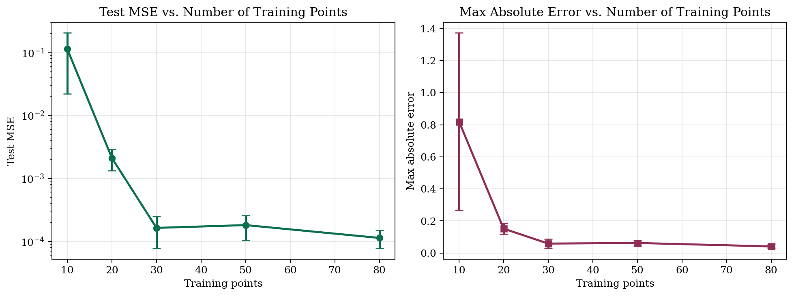
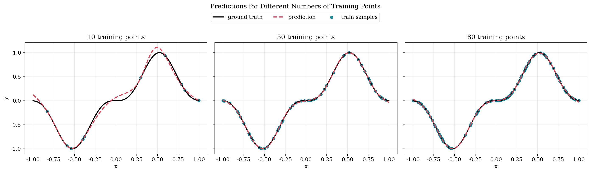
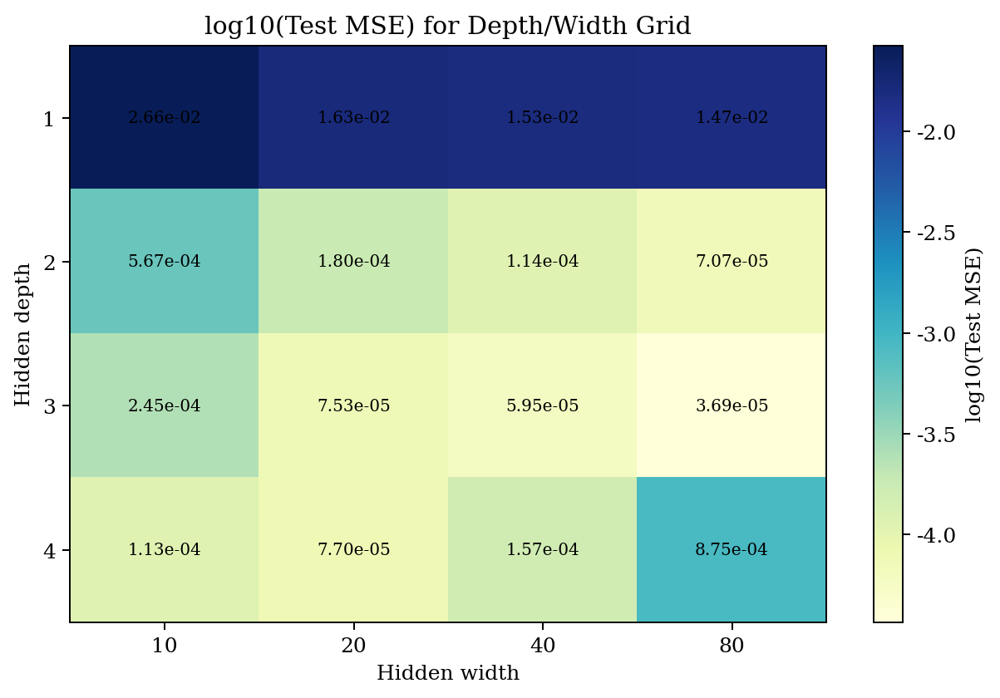
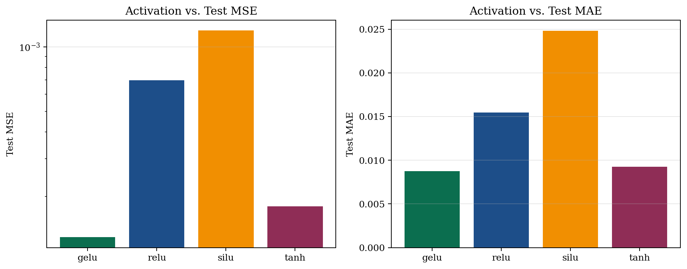
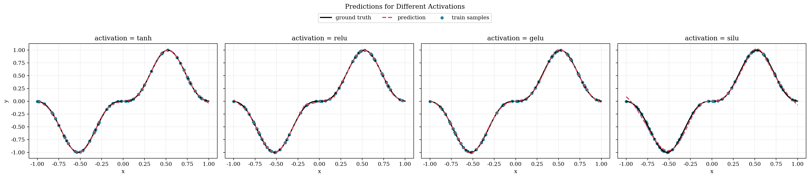

# 回归实验报告：训练点数与网络结构对预测精度的影响

## 1. 实验目标

本报告研究一维回归任务 `y = sin(3x)^3` 中，以下因素对预测精度的影响：

1. 训练点数 `num_train`
2. 隐藏层层数 `depth`
3. 隐藏层宽度 `width`
4. 激活函数 `activation`

目标是回答两个核心问题：

1. 数据量增加是否稳定提升测试集精度？
2. 更深、更宽、或不同激活函数是否一定带来更好的泛化？

## 2. 实验设置

- 框架：PyTorch
- 任务：在区间 `[-1, 1]` 上拟合 `y = sin(3x)^3`
- 参考测试集：`201` 个等间距采样点
- 优化器：Adam
- 学习率：`0.001`
- 训练步数：`3000`
- 随机重复：`3` 次，种子为 `[1234, 2024, 3407]`
- 默认基线网络：`depth=2, width=20, activation=tanh, num_train=50`
- 运行设备：`cpu`

评价指标：

- Test MSE：整体平方误差
- Test MAE：整体绝对误差
- Max Absolute Error：最坏点误差

## 3. 训练点数的影响

固定网络结构为 `depth=2, width=20, activation=tanh`，改变训练点数。

| Training points | Mean test MSE | Mean max abs error | Mean runtime (s) |
| --- | --- | --- | --- |
| 10 | 1.126e-01 | 8.201e-01 | 8.653e-01 |
| 20 | 2.099e-03 | 1.520e-01 | 8.737e-01 |
| 30 | 1.629e-04 | 5.895e-02 | 8.885e-01 |
| 50 | 1.804e-04 | 6.278e-02 | 9.031e-01 |
| 80 | 1.128e-04 | 4.122e-02 | 9.034e-01 |





结论：

- 训练点数从少量增加到中等规模时，测试误差下降明显。
- 点数过少时，模型在波峰和波谷附近会出现明显偏差，最大绝对误差较高。
- 从 `30` 到 `50` 个训练点没有严格单调下降，这更像是有限次随机采样带来的波动，而不是更大数据量失效。
- 当训练点数提升到较高水平后，误差继续下降，但边际收益开始减弱。

## 4. 隐藏层深度和宽度的影响

固定 `num_train=50, activation=tanh`，在深度和宽度上做二维网格搜索。



最佳 5 组结构如下：

| Depth | Width | Mean test MSE | Mean max abs error | Mean runtime (s) |
| --- | --- | --- | --- | --- |
| 3 | 80 | 3.688e-05 | 3.519e-02 | 1.5171 |
| 3 | 40 | 5.951e-05 | 4.313e-02 | 1.1446 |
| 2 | 80 | 7.070e-05 | 4.626e-02 | 1.3773 |
| 3 | 20 | 7.531e-05 | 4.648e-02 | 1.0973 |
| 4 | 20 | 7.704e-05 | 4.064e-02 | 1.2717 |

观察：

- 最优结构是 `depth=3, width=80`，平均 Test MSE 为 `3.688e-05`。
- 最差结构是 `depth=1, width=10`，平均 Test MSE 为 `2.659e-02`。
- 在这个小规模平滑回归任务中，网络并不是越深越好。深度过大时，训练成本增加，但泛化收益有限。
- 宽度从较小值增大时通常能降低误差，但当容量足够后收益趋于平缓。
- 如果同时考虑训练时间，`depth=2~3, width=20~40` 已经处在很有竞争力的精度区间，不必一开始就使用最宽网络。

## 5. 激活函数的影响

固定 `num_train=50, depth=2, width=20`，比较不同激活函数。

| Activation | Mean test MSE | Mean test MAE | Mean max abs error |
| --- | --- | --- | --- |
| gelu | 1.293e-04 | 8.744e-03 | 4.320e-02 |
| relu | 6.978e-04 | 1.546e-02 | 1.038e-01 |
| silu | 1.193e-03 | 2.481e-02 | 1.535e-01 |
| tanh | 1.804e-04 | 9.259e-03 | 6.278e-02 |





观察：

- 最优激活函数是 `gelu`，平均 Test MSE 为 `1.293e-04`。
- 最弱激活函数是 `silu`，平均 Test MSE 为 `1.193e-03`。
- 在这组训练预算下，`gelu` 的平均指标最好，`tanh` 非常接近且表现稳定。
- `relu` 和 `silu` 在当前宽度与深度设置下略弱，说明激活函数选择会影响曲线细节恢复质量。

## 6. 综合分析

从本次实验可以得到以下结论：

1. 数据量是第一位因素。训练点数不足时，模型结构再复杂也难以稳定恢复目标函数细节。
2. 适度增加模型容量有帮助，但存在饱和区。对于一维平滑回归，过深网络并不划算。
3. 激活函数会显著影响拟合形状。在本实验设置下，`gelu` 和 `tanh` 明显优于 `relu` 与 `silu`。
4. 如果目标是“精度/复杂度”平衡，优先建议：
   - 先把训练点数增加到中等规模以上
   - 再选择 `gelu` 或 `tanh`
   - 最后在中等深度、中等宽度附近微调结构

## 7. 本实验下的推荐配置

- 如果追求稳健泛化：使用 `num_train=50` 以上，`depth=2~3`，`width=20~40`，激活函数优先 `gelu` 或 `tanh`
- 如果追求更低训练成本：优先使用浅层中宽网络，而不是盲目增加深度
- 如果后续任务更复杂、噪声更大：建议继续扩展实验，加入噪声扰动、权重衰减和更大测试范围

## 8. 复现实验

在项目根目录执行：

```bash
/home/xuanli/miniforge/envs/phmbench/bin/python Codes/regression/torch/ablation_report.py
```

原始结果与图像输出目录：

- `Codes/regression/torch/report_assets/`
- `Codes/regression/torch/regression_experiment_report.md`
